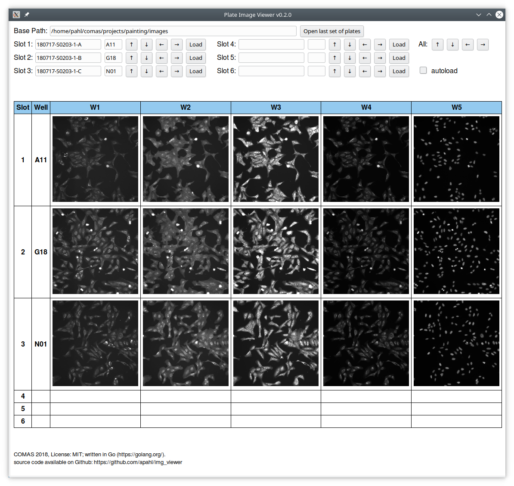

# img_viewer

A utility to visually analyse and compare the results from Cell Painting runs.  
Sample images for each plate have to be created with the `sample_images.sh` script (requires `imagemagick`) before the analysis, these can then be loaded with the tool.

The images can be stepped through for each plate individually using the arrows (if autoload is set, the new image will be automatically loaded) or for all loaded plates (using the arrows on the right ("All: ..." )).

img_viewer uses @zserge 's excellent [webview](https://github.com/zserge/webview) library for the GUI.

## Installation

With `go get`:  

    go get https://github.com/apahl/img_viewer

Cross-compilation on Linux to Windows, using go1.10.3, has been successful with:

    GOOS=windows GOARCH=amd64 CGO_ENABLED=1 CC=x86_64-w64-mingw32-gcc CXX=x86_64-w64-mingw32-g++ go build -ldflags "-H windowsgui" -o ImgViewer.exe

Or download a binary from the [releases](https://github.com/apahl/img_viewer/releases) page.